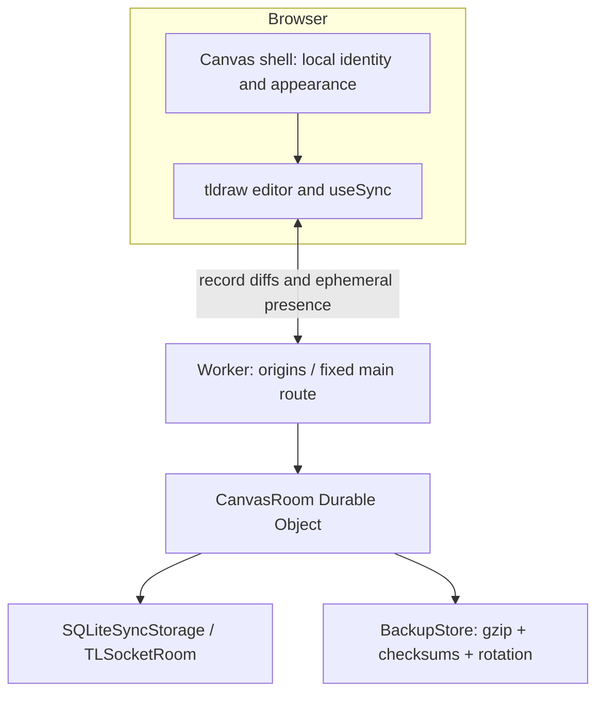

# Architecture decision — Canvas V1

**Decision date:** 2026-09-08. **State:** implemented source; integration certification pending.

## Editor and synchronization

Use React, strict TypeScript, Vite, and tldraw **5.4.1** with its official `useSync` / `TLSocketRoom` stack. Keep the editor, sync client, sync server, schema, and asset packages on the same exact version. Official sync owns record-level diffs, conflict resolution, protocol versions, client reconnection, schema negotiation, and the local-versus-remote history boundary. Canvas does not send its own full-document save on every editor change. [R1–R3]

The decision favors established collaboration and manipulation behavior over minimum licensing administration. Excalidraw has an MIT license and a capable infinite-canvas editor, but its own package FAQ explicitly says collaboration is not included in the npm component. Recreating that application's separate collaboration layer, persistence, reconciliation, and history integration would add more correctness risk to this small project. Konva is lower-level and would additionally require building much of the editor. Yjs is a synchronization building block, not a substitute for correct integration with editor history. No paid managed collaboration service is needed. [R4–R5]

**Tradeoff:** tldraw production needs a real approved key. Hobby approval is not guaranteed. Deployment is gated rather than shipping an app that silently breaks without a key. See THIRD_PARTY_NOTICES.md. If a suitable key is not available, treat an engine switch as a separately tested implementation change, not a runtime fallback sharing incompatible state.

## One world, one authority

Every accepted public connection is routed to `env.CANVAS_ROOM.idFromName('main')`. Only `/api/connect/main` is exposed; a different room path is 404. The editor hides page management, sets its page ceiling to one, and the server rejects additional pages and deletion of the primary page/document records.

The Worker is stateless outside request execution. It performs exact-origin checks, method checks, the public health response, and administration authorization. The Durable Object owns native SQL-backed sync storage, active WebSocket coordination, and compact backup tables. There is no R2, D1, PostgreSQL, Redis, database pool, or server-side preview fetcher.

Static frontend deployment is independent of world storage. Preserve the production Worker name, account, binding, Durable Object class, and migration history. Renaming infrastructure can point the frontend at a different empty namespace; deploying a new frontend does not itself migrate or erase records.

## Hibernation and session recovery

The DO uses `ctx.acceptWebSocket`, hibernation event handlers, and the official session snapshot/resume API. A minimal socket adapter omits `addEventListener`, preventing duplicate delivery through both the native listener path and DO callbacks. The current socket map is rebuilt after wake.

Platform auto-response handles the SDK's ping/pong pair without waking application code. Native finite batching/session-snapshot timers may run after activity; Canvas adds no heartbeat or interval loop. Healthy sessions use the starter's hibernation-compatible infinite application idle timeout. [R2, R6]

Session attachments hold the native resumable session snapshot plus the small rate/chunk guard state. If the schema is identical, it is omitted from the attachment and reconstructed **only when the engine version matches**. If a snapshot would exceed the safe attachment budget, an incomplete chunk stream survives eviction, or a session cannot be resumed safely, the socket closes with a retryable code and the official client reconnects. Document authority remains SQL, not the attachment or a JavaScript map. An old socket's close callback is prevented from tearing down its replacement session.

Actual Cloudflare eviction/idle-wake execution is a remaining release gate, not something proven by the core unit suite.

## Presence, identity, and history

The stable browser UUID, display name, and curated color are stored locally. They are not credentials. `users.currentUser` is null: tldraw 5.4 adds persistent attribution user records, which are outside Canvas's requirements. A supported custom presence derivation overlays the local UUID/name/color onto the native presence data. The server rejects `user` records as an additional safeguard. Cursors, online state, selections, and names are not persisted as document records. [R3]

The editor retains native selection/transformation/undo behavior. There is no global snapshot-based undo. The multiplayer regression specifically checks that one browser's undo does not remove an unrelated edit from another browser. That test is written but has not run in the authoring environment.

Native sync batching owns drawing/document/presence transport; there is no second batching layer that could reorder commits. Per-socket message and byte token buckets limit accidental floods. Exact message rates during active drawing still need benchmark measurements.

## Input boundary and storage limits

Frontend controls, external-content handlers, capture-phase paste/drop handlers, and the server all enforce the media exclusion. URLs become plain text. Assets and persistent user records are rejected on the server even when a modified browser ignores the UI.

The engine validates its records and protocol. Additional iterative JSON checks cap structure depth/nodes and reject dangerous object keys. Guards cap individual frames, aggregate native chunk streams, records, text, coordinates, connection count, and world bytes. Per-record byte accounting avoids serializing the whole world on every drag. Shape and byte budgets apply to successful native commits, not speculative frontend saves.

The world budget is 8 MiB of serialized current records, not a promise that the complete SQLite database is that size. Native sync metadata, tombstones, SQL indexes, and backups add overhead. The backup blob budget is separately capped at 64 MiB. These are tiny-group safety limits, not a substitute for DDoS protection.

Vector paths remain native. No rasterization or custom simplification is introduced. The impact of the per-record limit on unusually long uninterrupted pen strokes is part of the manual performance/interaction audit.

## Backups and restoration

Primary persistence is native synchronous SQLite sync storage. Backups are recovery points, not the authoritative save mechanism. Document commits schedule a finite alarm; inactivity without changes does not require polling. Recent/daily backups are content-clock deduplicated. A capped pre-deletion path reconstructs the previous state using accepted changes and captured prior records. Backup compression happens outside the native commit callback.

Backup metadata and binary chunks are committed and rotated in one SQL transaction. The implementation validates version, record policy, byte budgets, checksums, and decompressed size. The portable `canvas-backup` envelope includes engine and schema versions.

Admin restore requires a private token, no browser Origin header, zero open clients, an exact current-clock precondition, explicit CLI confirmation, matching schema/engine versions, and a successful pre-restore backup. Imported historical clocks and tombstones are not applied over the live clock. Native transactional loading sets the restored records at a new server clock. Downloaded backups remain necessary protection against account loss or deletion of the entire DO namespace; same-database snapshots do not cover that failure.

## Failure and upgrade policy

Detected disconnection switches the editor to read-only while retaining the native sync client in the tab. The UI does not advertise full offline-first persistence or a per-keystroke saved guarantee. A user can export an unconfirmed local recovery copy while disconnected. A hard configuration error is shown explicitly; there is no local-only substitute masquerading as the permanent shared world.

The portable backup format is version 1. Engine versions are exact-pinned; exports are rejected for incompatible restore versions. Before an engine upgrade, export the world, migrate a copy in isolated storage, run multiplayer/undo/restart/restore regressions, then deploy coordinated client/server versions. A code rollback does not roll back SQL schema or data automatically.

Future authentication belongs at connection admission and native session metadata, not inside shape IDs. Future room support belongs at the Worker routing boundary. Neither feature is implemented in V1.

## Cost and maintenance

Free-tier personal usage is a target, conditional on applicable Cloudflare allowances and a suitable tldraw license. Incoming WebSocket messages, document writes, backup writes, and active duration still consume resources. Hibernation reduces idle compute; it does not make unlimited active collaboration free. Public misuse can exhaust limits. Inspect real Cloudflare analytics rather than extrapolating a monthly bill from an unrun benchmark. [R6–R7]

References R1–R8 are in RESEARCH.md. Implementation-specific statements here describe the checked-in code; AUDIT.md describes the narrower execution evidence.
