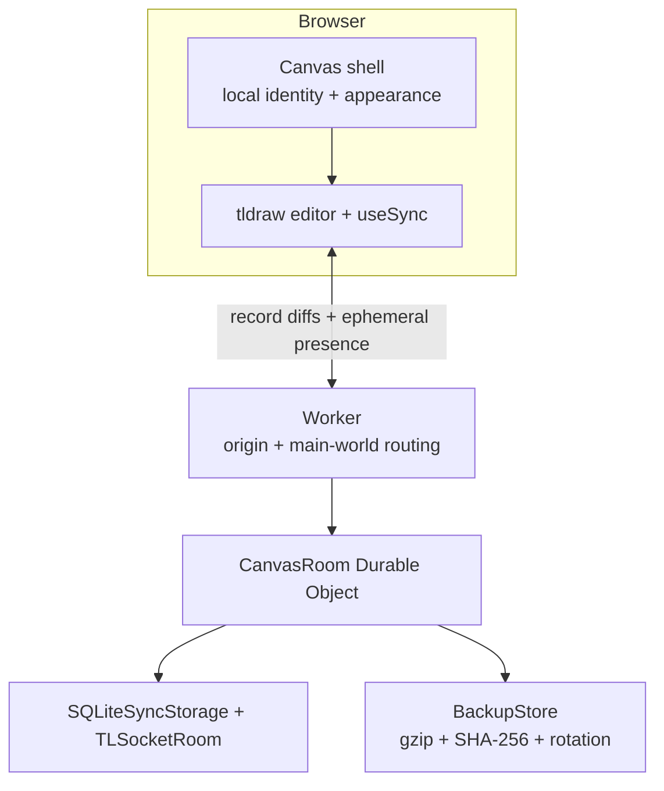

# Architecture decision — Canvas V1

**Decision date:** 2026-09-08. **State:** implemented and locally integration-tested; production Cloudflare deployment verification remains owner-operated.

## Editor and synchronization

Use React, strict TypeScript, Vite, and tldraw **5.4.0** with its official `useSync` / `TLSocketRoom` stack. Keep the editor, sync client, sync server, schema, and asset packages on the same exact version. Official sync owns record-level diffs, conflict resolution, protocol versions, client reconnection, schema negotiation, and the local-versus-remote history boundary. Canvas does not send its own full-document save on every editor change. See [RESEARCH.md](RESEARCH.md).

The GitHub project released v5.4.1 during hardening, but the complete 5.4.1 npm package family was unavailable together (`@tldraw/sync@5.4.1` returned npm `ETARGET`). The release therefore pins the complete npm family to 5.4.0 rather than mixing incompatible package versions.

The decision favors established collaboration and manipulation behavior over minimum licensing administration. Excalidraw has an MIT license and a capable infinite-canvas editor, but its packaged component does not provide its hosted application's collaboration backend as a drop-in module. Recreating the synchronization, persistence, reconciliation, and history layer would add correctness risk. Konva is lower-level; Yjs is a synchronization primitive rather than a complete editor integration. No paid managed collaboration service is needed.

**Tradeoff:** tldraw production needs a valid key. Hobby approval is not guaranteed. Deployment is gated rather than shipping an app that silently breaks without a key. If a suitable key is unavailable, an engine change must be treated as a separately migrated and tested architecture change, not as a runtime fallback sharing the same stored world.

## One world, one authority

Every accepted public connection is routed to `env.CANVAS_ROOM.idFromName('main')`. Only `/api/connect/main` is exposed; there is no rooms UI or world creation flow. The editor hides page management, caps pages at one, and the server protects the primary page/document records.

The Worker is stateless outside request execution. It performs exact-origin checks, method checks, health responses, and administration authorization. The Durable Object owns SQL-backed sync storage, active WebSocket coordination, and compact recovery tables. There is no R2, D1, PostgreSQL, Redis, database pool, server-side preview fetcher, or managed realtime provider.

Static frontend deployment is independent of world storage. Preserve the production Worker name/account, Durable Object binding/class, and migration history. Renaming infrastructure can point the frontend at a different empty namespace; deploying a new frontend does not itself migrate or erase records.

## Hibernation and session recovery

The Durable Object uses `ctx.acceptWebSocket`, hibernation event handlers, and tldraw's session snapshot/resume API. A minimal socket adapter deliberately omits ordinary `addEventListener` wiring so the same socket event is not delivered through both a library listener path and Durable Object hibernation callbacks. The current socket map is reconstructed after wake.

Platform auto-response handles the SDK ping/pong pair without waking application code. Canvas adds no heartbeat or permanent interval loop. Native finite timers may run briefly after activity.

Session attachments contain the resumable session snapshot plus small rate/chunk-guard state. If the schema is identical, redundant schema material can be omitted and reconstructed only when the recorded engine version matches. If a snapshot is not safe to resume—for example because attachment state is incomplete—the socket closes with a retryable code and the official client performs a clean reconnect/rebase. Authoritative document state remains SQLite, never a JavaScript map or WebSocket attachment.

Local Wrangler restart/reconnect tests and browser reconnect tests pass. **Actual production Cloudflare idle eviction and wake is not claimed as verified until the deployed Worker is exercised on Cloudflare infrastructure.**

## Presence, identity, and history

A stable browser UUID, editable display name, and curated color live in local browser storage. They are presence hints, not credentials. Canvas keeps the tldraw current-user store null and derives native presence from the local identity. The server rejects persistent `user` records. Cursors, names, selections, current tool, and online status do not enter durable document state.

The editor retains tldraw's native history semantics. There is no global snapshot-based undo. The cross-browser multiplayer regression verifies that one browser's undo removes its own operation without deleting an unrelated edit created by another browser; that scenario passed in the release hardening suite.

Native sync batching owns drawing/document/presence transport. Canvas does not add another application-level batching layer that could reorder commits.

## Input boundary and storage limits

Frontend controls, content handlers, capture-phase paste/drop guards, the no-op asset store, and server record authorization all enforce the media exclusion. URLs become plain text. Assets and persistent user records are rejected on the server even if a modified browser ignores the UI.

The engine validates its own records/protocol. Canvas adds iterative JSON checks and explicit limits for individual WebSocket frames, aggregate chunk streams, records, text, coordinates, connections, shape count, and current-world serialized bytes. Per-record accounting avoids whole-world serialization on every drag.

Current safety ceilings include:

- 20 connected sockets;
- 10,000 shapes;
- 8 MiB current serialized-record budget;
- 128 KiB per record;
- 20,000 characters per text object;
- 1 MiB WebSocket frame guard and bounded aggregate messages;
- bounded per-socket message and byte token buckets.

The 8 MiB world budget is not a promise that the complete SQLite file is 8 MiB: sync metadata, tombstones, indexes, and recovery snapshots add overhead. Recovery data has its own bounded budget.

Vector paths remain native. Canvas does not rasterize freehand strokes and does not introduce a second simplification algorithm over tldraw's geometry.

## Backups and restoration

Primary persistence is tldraw's synchronous SQLite sync storage. Backups are recovery points, not the authoritative save mechanism. Document commits schedule finite alarms; inactivity does not require polling. Automatic/recent/daily snapshots are clock-deduplicated. A capped pre-deletion path reconstructs the state immediately before destructive changes from captured accepted records.

Backup metadata and compressed binary chunks are inserted and rotated transactionally. Backup envelopes are gzip-compressed, SHA-256 checked, size-bounded, and versioned. The portable envelope records engine/schema information.

Administrative restore requires:

- a private `ADMIN_TOKEN` that never enters frontend configuration;
- no browser Origin header;
- zero currently open clients;
- an exact current-clock `If-Match` precondition;
- schema validation;
- explicit owner confirmation in the CLI workflow;
- a successful pre-restore snapshot.

Imported historical clocks/tombstones are not laid over the live synchronization clock. Restore loads validated records transactionally at a new server clock. Downloaded exports remain necessary protection against loss of the Cloudflare account/namespace itself; same-Durable-Object snapshots cannot cover deletion of that entire infrastructure.

## Failure and upgrade policy

Detected disconnection makes the editor read-only while the sync client remains alive for reconnection. The UI does not promise multi-hour offline-first collaboration or per-keystroke durability acknowledgement. A user can export a local recovery copy if needed. Hard configuration errors are visible; there is no local-only document silently masquerading as the shared world.

The portable backup format is version 1. Engine versions are exact-pinned. Before any tldraw major/minor migration that changes stored schema/protocol assumptions:

1. export the current world;
2. restore/migrate a copy in isolated storage;
3. run multiplayer, undo, restart, reconnect, media-rejection, and restore regressions;
4. deploy coordinated client/server versions;
5. verify production state before retiring the previous deployment.

A source rollback does not automatically roll back Durable Object schema/data.

Future authentication belongs at connection admission/session metadata. Future room support belongs at the Worker routing boundary. Neither is implemented in V1.

## Performance and cost

The dedicated 2026-09-08 Chromium benchmark measured real persisted scenes:

| Shapes | Serialized scene | Median frame | p95 frame | JS heap |
| ---: | ---: | ---: | ---: | ---: |
| 100 | 35.6 KB | 16.7 ms | 16.8 ms | 38 MiB |
| 1,000 | 358 KB | 16.7 ms | 16.9 ms | 88 MiB |
| 5,000 | 1.80 MB | 16.7 ms | 19.4 ms | 239 MiB |
| 10,000 | 3.59 MB | 18.5 ms | 26.0 ms | 825 MiB |

The 10,000-shape ceiling is therefore a stress boundary, not the desired steady-state scene size. Memory is the dominant measured limitation at that scale. For the intended one-to-ten-person private canvas with mostly text/vector content, 1,000–5,000 simple shapes remain the more representative range.

The architecture targets very low/free-tier personal cost, not guaranteed zero cost under arbitrary public traffic. Hibernation reduces idle compute but does not make unlimited active traffic free. Real production usage should be checked in Cloudflare analytics.

## Deliberate seams

Future authentication can associate a connection with optional session/user metadata without changing shape IDs. Future multiple-room support can map a validated `worldId` to a Durable Object name without changing the editor data model. V1 intentionally exposes only `main` and no authentication.

Implementation-specific claims here describe the checked-in architecture. [AUDIT.md](AUDIT.md) records what has and has not been verified in execution.
