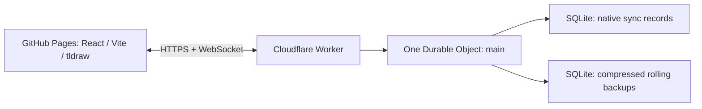

# Canvas

A lightweight persistent realtime infinite canvas for drawing, writing, and thinking together.

**One world. No accounts. No uploads. Open the link and work on the same sheet.**

## Release status — 1.0.0-rc.1

This repository contains the application source, Worker, recovery tooling, test suites, and deployment workflows. **It is a source release candidate, not a certified production release.** The authoring runner could not reach the npm registry. Consequently, no real dependency lockfile, installed SDK integration check, production bundle, or browser certification was produced there.

The dependency-independent suite **passes 33 tests**, including real SQLite backup persistence and transactional recovery tests. A strict type check of that tested core and syntax checks of all application/test/script sources passed. The remaining gates are explicit in [AUDIT.md](AUDIT.md); they must pass before publication. Browser tests and benchmark code are included, but their existence is not a claim that they ran successfully.

## Application

The source integrates text and lightweight formatting, vector pen/highlighter strokes, rectangles, ellipses, diamonds, lines, arrows/connectors, frames, and native selection, movement, resize, rotation, grouping, copy/paste, eraser, undo, and redo. The surrounding Canvas interface adds Home, fit-content, mobile-accessible undo/redo and zoom controls, a reduced toolbar, local display-name editing, connected presence, connection feedback, system/light/dark appearance, and JSON export.

The editor's existing interaction and collaboration machinery is retained rather than replaced with custom full-scene saves. Media is blocked both in the frontend and on the server. URLs paste as plain text; there is no preview scraper or asset bucket. Frames organize regions within the same page.

A manifest, icons, and a scoped service worker support installation and static-shell caching. **A backend connection is required for collaboration.** After a detected disconnect, editing pauses; the official sync client retains pending work in the current tab and attempts to reconnect. Do not close an offline tab without exporting a recovery copy. `Live` means connected, not a durability acknowledgement for every individual keystroke.

## Architecture



The editor and official synchronization packages are pinned together to **tldraw 5.4.1**. There is no separate database, R2 bucket, managed multiplayer subscription, account service, or always-running server. See [ARCHITECTURE.md](ARCHITECTURE.md) for the decision, boundaries, and failure model, and [RESEARCH.md](RESEARCH.md) for the official sources checked on 8 September 2026.

## Run locally

Use a current Node.js 22 LTS patch release or a compatible newer LTS release. The executable core was checked under Node 22.16.0. An internet connection is required for the first npm installation.

```sh
cd Canvas
npm install
cp .env.example .env
npm run dev
```

Open `http://127.0.0.1:5173/Canvas/`. The combined command starts the frontend and local Wrangler backend at port 8787. Alternatively, use `npm run dev:worker` and `npm run dev:web` in separate terminals. Local SQLite is under `.wrangler/`; deleting it deletes the **local** world, not the deployed world.

On Windows, copy the example file using File Explorer or `Copy-Item .env.example .env` in PowerShell. A localhost tldraw license key is not required. Generate an optional local administration token in `.dev.vars` using [.dev.vars.example](.dev.vars.example); ordinary drawing does not need it.

**Bootstrap requirement:** installation must generate a genuine `package-lock.json`. Review `npm audit`, run the complete checks, and commit the lockfile. Do not replace it with a root-only placeholder. Subsequent installations and releases should use `npm ci`.

## Check the implementation

```sh
npm run lint
npm run typecheck
npm test
npm run test:worker
npm run check:worker
npm run build
npx playwright install --with-deps chromium firefox webkit
npm run test:e2e
npm run test:production
npm run test:performance
```

`npm run check` combines the main checks, excluding the separately invoked large-scene benchmark. `test:production` builds an optimized **local-backend** preview into `.preview-dist` and uses isolated test storage; it never tests against the real world or overwrites `dist`. Tests contain a known local-only admin token; the test Worker configuration refuses public hostnames.

The normal production bundle excludes the test bridge. `scripts/audit-build.mjs` checks for its accidental inclusion and writes actual bundle measurements after a successful build. The preview smoke test also records an actual editor screenshot in `artifacts/Canvas-desktop.png`. No fabricated screenshot or benchmark is included in this candidate.

## Deploy

See [DEPLOYMENT.md](DEPLOYMENT.md) for the complete sequence. The only owner-supplied configuration is your Cloudflare account/deployment, allowed frontend origins, public backend URL, tldraw production key, and private recovery token.

The repository is named **Canvas**, and `/Canvas/` is the default Vite base. Production runs from static files; GitHub Pages never runs the Worker. The Pages workflow requires successful checks, a committed lockfile, production configuration, and explicit deployment enablement. A custom-domain deployment normally changes the base to `/`; it need not change the backend or world.

## Persistence and recovery

Shared document state is stored by the native sync SQLite adapter, not by one browser. Presence is ephemeral. In particular, the SDK's current-user store is deliberately null to avoid its newer persistent attribution/user-record behavior; the anonymous identity feeds only presence and local preferences.

Automatic backup alarms are scheduled by document changes, not by an idle polling loop. Backups are gzip-compressed, checked with SHA-256, chunked into SQL rows, and rotated transactionally. Retention allows up to 16 recent, seven daily, four manual, four pre-restore, and four pre-deletion backups, within a total compressed-data budget of 64 MiB. The byte cap can reduce those counts. Unchanged worlds are not duplicated every day. Pre-deletion capture is limited to once per minute.

Export a JSON backup from the Canvas menu. Restoring the entire world is deliberately **not** a public editor feature. The owner uses the CLI and a separate secret, closes all tabs, reviews the current clock, and explicitly confirms the restore. A pre-restore backup is taken first. See the recovery runbook in [DEPLOYMENT.md](DEPLOYMENT.md).

## Limits and omissions

The target is approximately ten active friends; the hard connection ceiling is 20 to leave room for multiple tabs. The world has both a 10,000-shape ceiling and an 8 MiB serialized-record budget. A record is limited to 128 KiB and a text object to 20,000 characters. Large selections may need to be pasted in smaller groups. Native vector stroke geometry is preserved; no second simplification pass is added.

There is no public world import, search, landmarks menu, separate rooms, permissions, comments, chat, tasks, AI, or binary upload. Native zoom and Home/fit navigation remain. Long-duration offline-first editing is intentionally not promised. Real Safari/iPad stylus behavior, large-scene performance, and deployed hibernation still require the release checks described in [TESTING.md](TESTING.md).

## Access, costs, and licensing

**Anyone who can reach the Canvas can read and edit it.** Display names are not authentication, and an origin allowlist is not privacy protection. Do not put confidential information into this world. No analytics or tracking service is added. See [SECURITY.md](SECURITY.md).

The architecture targets free-tier personal usage, not guaranteed zero cost under arbitrary public traffic. A tldraw production key is required. Free hobby keys are discretionary and retain a watermark; trial or commercial terms differ. A missing production key produces a configuration error instead of pretending that deployment is usable. See [THIRD_PARTY_NOTICES.md](THIRD_PARTY_NOTICES.md) for the licensing and telemetry details.

## Repository map

| Location | Responsibility |
| --- | --- |
| `app/` | Editor integration, Canvas interface, local preferences and clipboard guards |
| `shared/` | Product limits, record policy, backup format, bounded JSON validation |
| `worker/` | Single-world routing, native sync Durable Object, limits and SQL backups |
| `scripts/` | Development, administration, build audit and release verification |
| `tests/unit/` | Runnable core and real SQLite backup tests |
| `tests/worker/` | Local Wrangler HTTP and process-restart tests |
| `tests/e2e/` | Multiplayer, interaction, responsive, preview and stress regressions |
| `.github/workflows/` | Checks, gated Pages deployment, manual performance workflow |
| `docs/evidence/` | Actual authoring-runner evidence, not simulated browser results |

Application-specific source is MIT-licensed. That does not relicense the tldraw SDK or its assets. Future changes should first improve verified reliability and recovery, not add more product categories.
