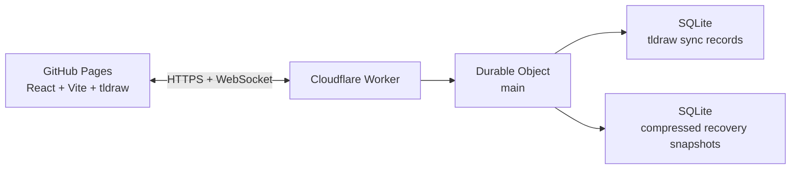

# Canvas

A lightweight persistent realtime infinite canvas for drawing, writing, and thinking together.

**One world. No accounts. No uploads. Open the link and work on the same sheet.**

## Release status

Canvas `1.0.0-rc.1` is implemented on the `release/canvas-v1-hardening` branch and tracked in PR #1. The application, Worker, recovery tooling, tests, lockfile, CI, Pages workflow, PWA assets, and deployment documentation are present.

Release certification is evidence-driven. The hardening suite has already demonstrated 33/33 unit tests, 5/5 Worker integration tests, and a complete Chromium/Firefox/WebKit collaboration run with 61 passed and four intentional skips. A dedicated Chromium large-scene benchmark also passed at 100, 1,000, 5,000, and 10,000 persisted shapes. The exact final branch head must still have a green `Canvas checks and Pages` workflow before merge; see [AUDIT.md](AUDIT.md) and [TESTING.md](TESTING.md).

## What Canvas does

Canvas is one permanent shared sheet. It provides:

- text and lightweight text styling;
- vector pen and highlighter strokes;
- rectangle, ellipse, diamond, line, arrow, and frame tools;
- native selection, move, resize, rotate, group/ungroup, duplicate, copy/paste, delete, eraser, undo, and redo;
- live cursors, names, selection presence, collaborator list, and connection state;
- Home, fit-content, zoom, touch/mobile controls, system/light/dark appearance, and JSON export;
- server-authoritative persistence and rolling administrative recovery snapshots.

Images, video, audio, PDFs, file attachments, embeds, asset libraries, and binary paste/drop are deliberately disabled in both frontend and backend. URLs paste as text. Frames are the organizational primitive; there are no boards, workspaces, accounts, permissions, comments, chat, tasks, or AI features.

## Architecture



The editor and synchronization packages are pinned together to **tldraw 5.4.0**. The GitHub v5.4.1 release exists, but the complete 5.4.1 npm package family was not published together during hardening, so using it produced an npm `ETARGET`. Pinning one tested version across `tldraw`, `@tldraw/sync`, `@tldraw/sync-core`, `@tldraw/tlschema`, and `@tldraw/assets` avoids a mixed protocol/schema stack.

The Durable Object uses tldraw's SQLite sync storage and Cloudflare's WebSocket Hibernation API. Presence is ephemeral. Persistent document records use record-level synchronization rather than repeated whole-scene replacement. No PostgreSQL, Supabase, Firebase, Redis, R2, paid realtime provider, or always-on VPS is required.

See [ARCHITECTURE.md](ARCHITECTURE.md) and [RESEARCH.md](RESEARCH.md).

## Local development

Requires Node.js `>=22.16.0` and npm.

```sh
git clone https://github.com/thiepn/canvas.git
cd canvas
npm ci
cp .env.example .env
npm run dev
```

Open `http://127.0.0.1:5173/canvas/`. `npm run dev` starts Vite and the local Wrangler Worker. Local Durable Object data lives under `.wrangler/` and is separate from production.

A tldraw production license key is not required on localhost. Optional administrative backup/restore commands use the local token described in `.dev.vars.example`.

## Verification

```sh
npm run lint
npm run typecheck
npm test
npm run test:worker
npm run check:worker
npm run build
npx playwright install --with-deps chromium firefox webkit
npm run test:e2e
npm run test:production
npm run test:performance
```

The CI quality gate additionally runs `npm audit --audit-level=high`. A patched `sharp 0.35.4` transitive override is retained because the current Wrangler/Miniflare dependency graph otherwise resolves an advisory-affected `sharp 0.35.2`; the Worker suite verifies that override against the actual development runtime.

### Performance evidence

The dedicated GitHub-hosted Chromium benchmark persisted real shared-state shapes through the Worker and measured the synchronized client afterward:

| Shapes | Persist + generate | Serialized scene | Median frame | p95 frame | JS heap |
| ---: | ---: | ---: | ---: | ---: | ---: |
| 100 | 2.18 s | 35.6 KB | 16.7 ms | 16.8 ms | 38 MiB |
| 1,000 | 5.78 s | 358 KB | 16.7 ms | 16.9 ms | 88 MiB |
| 5,000 | 26.9 s | 1.80 MB | 16.7 ms | 19.4 ms | 239 MiB |
| 10,000 | 58.9 s | 3.59 MB | 18.5 ms | 26.0 ms | 825 MiB |

The 10,000-shape result is deliberately treated as an upper-end stress case, not a normal target. Memory growth at that level is the clearest measured performance weakness. Canvas is optimized for a small shared world used by roughly ten people, not arbitrarily large diagrams.

## Persistence, reconnect, and recovery

The authoritative world is stored in Durable Object SQLite. Closing every browser does not delete it. tldraw sync handles record-level convergence and local collaborative undo semantics. Temporary disconnection is visible in the UI; editing pauses when the application knows it is offline, and the sync client reconnects automatically when connectivity returns.

Recovery snapshots are gzip-compressed, SHA-256 checked, chunked into SQLite rows, and rotated. Automatic, daily, pre-deletion, pre-restore, and manual snapshot kinds are supported within a bounded retention budget. Restore is intentionally not exposed in the anonymous public UI: the owner uses the administration CLI/endpoint with `ADMIN_TOKEN`, zero active clients, and an `If-Match` world clock. A pre-restore snapshot is taken before destructive replacement.

## Deployment

The intended frontend URL is:

`https://thiepn.github.io/canvas/`

The Worker configuration already allows the `https://thiepn.github.io` origin plus localhost development origins. The repository-project Vite base is `/canvas/`; use `/` for a future custom domain.

Deployment requires only owner-controlled configuration:

1. authenticate Wrangler and deploy the Worker;
2. create a strong Cloudflare `ADMIN_TOKEN` secret;
3. set GitHub variable `VITE_CANVAS_API_URL` to the deployed HTTPS Worker origin;
4. set GitHub secret `VITE_TLDRAW_LICENSE_KEY` to a valid tldraw production key;
5. set `VITE_BASE_PATH=/canvas/`;
6. select GitHub Actions as the Pages source;
7. set `CANVAS_DEPLOY_ENABLED=true` only when the backend configuration is ready;
8. merge the certified release branch.

Exact commands and the recovery runbook are in [DEPLOYMENT.md](DEPLOYMENT.md).

## Security and privacy model

**Anyone who can reach Canvas can read and edit the shared world.** Names and colors are presence hints, not identity proof. The origin allowlist prevents accidental embedding/origin use; it is not authentication or cryptographic privacy.

Canvas adds no analytics, ad tracking, account database, or upload storage. Backend input is bounded and validated, unsupported persistent record types are rejected, and administrative restore requires a secret that never enters the frontend bundle. Do not store confidential information in an anonymous shared world.

See [SECURITY.md](SECURITY.md) and [THIRD_PARTY_NOTICES.md](THIRD_PARTY_NOTICES.md).

## Licensing

Application-specific source is MIT licensed. tldraw and its assets retain their own license terms. Production use requires a valid tldraw license key; qualifying hobby use may use tldraw's hobby license and required watermark. Trial/hobby key validation behavior is documented in [THIRD_PARTY_NOTICES.md](THIRD_PARTY_NOTICES.md).

## Repository map

| Location | Responsibility |
| --- | --- |
| `app/` | Editor integration, product chrome, identity, clipboard/media guards |
| `shared/` | Record policy, limits, recovery format, bounded JSON utilities |
| `worker/` | One-world routing, Durable Object sync, validation, backups |
| `scripts/` | Local orchestration, administration, build/release checks |
| `tests/unit/` | Identity/config/policy/recovery/storage unit coverage |
| `tests/worker/` | Local Wrangler HTTP, persistence, restart, and backend guards |
| `tests/e2e/` | Collaboration, reconnect, undo, media rejection, responsive and stress cases |
| `.github/workflows/` | Read-only quality CI, gated Pages deployment, manual performance evidence |

Future work should improve measured reliability, recovery, and large-scene efficiency before expanding the product surface.
